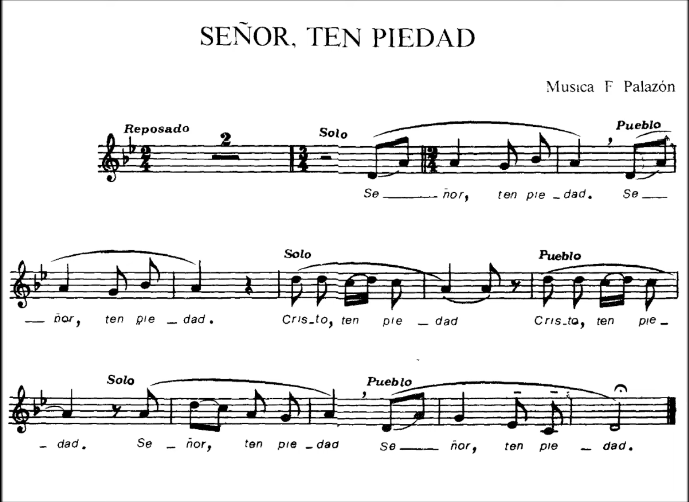

[← Volver al esquema de Dulce Corazon](../magdalena.md){ .md-button }

# Señor



```bash
CAPO 2

          A.  Bm.     C#m
Gloria a Dios en el Cielo
Bm              E
y en la tierra paz
      A   F#m
a los hom-bres
    Bm E.     A
que a--ma el Señor

A                            D  A
Por tu inmensa gloria te alaba-mos
Bm                   E.  A
te bendecimos te adora--mos
C#m
te glorificamos
         Bm.   E
te damos gra--cias

A
Señor Dios rey celestial
                     D. A
Dios Padre todo podero--so
Bm                    E.  A
Señor Hijo unico Jesucristo
C#m
Señor Dios, Cordero de Dios
          Bm. E
Hijo del Pa--dre

A
Tu que quitas el pecado del mundo
                 D. A
Ten piedad de Nosotros
Bm
Tu que quitas el pecado del mundo
                  E  A
atiende nuestra suplica
C#m
Tu que estas sentado a la derecha del padre
                Bm E
ten piedad de nosotros

A
Poruqe solo tue eres santo
         D A
solo tu señor
Bm                    E  A
Solo tu altisimo Jesucristo
C#m
Con el espíritu santo
                      Bm. E
en la gloria de Dios pa--dre
D  C#m.  Bm  A
A - a  - a  men


```

<iframe width="560" height="315" src="https://www.youtube.com/embed/Fz1KzddPNa8?si=TxqUQDk2xd_q1mkU" title="YouTube video player" frameborder="0" allow="accelerometer; autoplay; clipboard-write; encrypted-media; gyroscope; picture-in-picture; web-share" referrerpolicy="strict-origin-when-cross-origin" allowfullscreen></iframe>

<iframe data-testid="embed-iframe" style="border-radius:12px" src="https://open.spotify.com/embed/track/7lfFJhlB7KlPOQxnOFV26Y?utm_source=generator" width="100%" height="352" frameBorder="0" allowfullscreen="" allow="autoplay; clipboard-write; encrypted-media; fullscreen; picture-in-picture" loading="lazy"></iframe>
